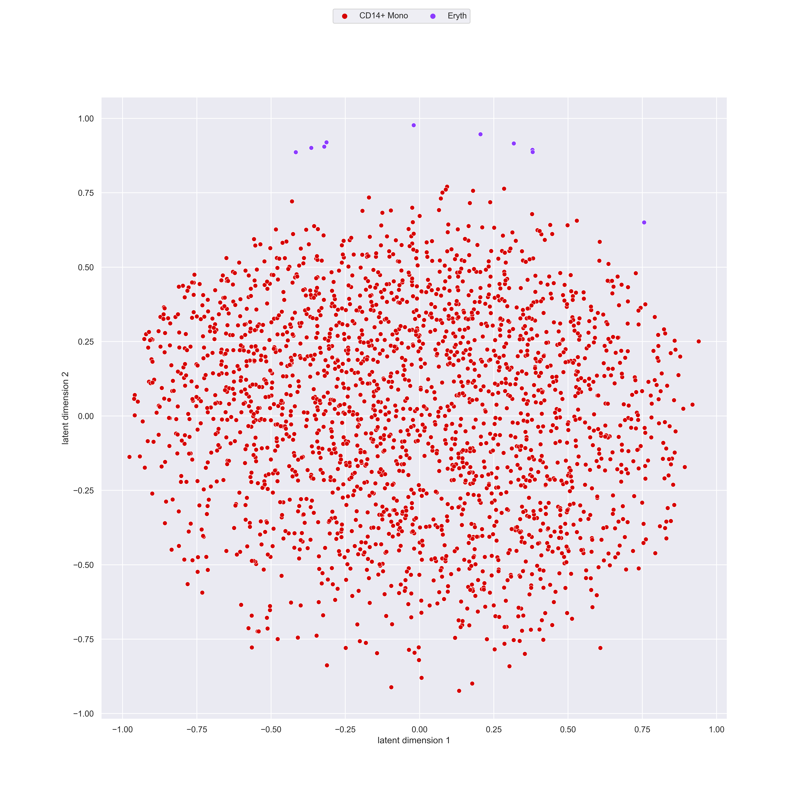

Deep generative model embedding single-cell RNA-Seq profiles on hyperspheres or hyperbolic spaces
====================

## System requirements
scPhere has been tested on Python 3.7.16 on macOS (Moneterey 12.5).

No special hardware is required.


## Installation 

Dependencies

* Python 3.7.16 or above 
* numpy >= 1.21.5
* scipy >= 1.7.3
* pandas >= 1.3.5
* matplotlib >= 3.5.3
* seaborn >= 0.12.2
* PyTorch >= 1.12.1
* pyshp >= 2.1.3
* colorcet >= 3.0.1
* jupyter >= 1.0.0

1) Clone the repository using `git clone https://github.com/Ding-Group/scPhere.git`.
2) Install the dependencies found in `environment.yml` with `conda env create -f environment.yml`.
4) Run demos (below):
    * If running the Jupyter Notebook, simply choose the conda environment as the kernel and run the cells. Run the first cell only once to revert back to the root scPhere folder. Make sure that the working directory is this directory.
    * If running the scripts, `cd` into the root scPhere folder, then run `export PYTHONPATH="${PYTHONPATH}:./"` and finally use `python ./example/script/demo_monocytes.py` in the terminal.

## Running scPhere

In `/example/script/` we provide two examples on how to run scPhere using data in the folder `/example/data`. Please also note that in the former folder we've provided Jupyter notebooks for the first demo.

1) A relatively small dataset can be ran with `/example/script/demo_monocytes.py` and trains the scPhere model on the hyperbolic space. It takes about 2 minutes to run this script. The script will produce four major files in the folder `/example/demo-out/`: 

* wn_250epoch_monocytes_latent.tsv (the embeddings in the hyperbolic space)
* wn_250epoch_monocytes_latents.png (visualization of the embedding)
* wn_250epoch_monocytes_train.png (the log-likelihood and KL-divergence at each iteration)
* wn_250epoch_monocytes_model.pth (the trained scPhere model that can be used later)



2) Uses a larger dataset and can be ran with `/example/script/demo_epi.py`. In this case the model is trained on the hyperspherical space. Before running the script, download the `uc_epi.mtx` file from the Single Cell Portal (https://singlecell.broadinstitute.org/single_cell/study/SCP551/scphere#study-download). 
You need a Google account to login to Google cloud for data downloading. The outputs of the demo are the same as in the previous, except:

* vmf_50epoch_latents.png (projects the 3D sphere into its Equal Earth projection in 2D). To obtain the 3D sphere representation, use the script at the end of this file.


```R
library("rgl")
library(densitycut) # https://bitbucket.org/jerry00/densitycut_dev/src/master/
library(robustbase)

PlotSphere = function(x, cluster, col, density=FALSE, legend=FALSE) {
  if (missing(col)) {
    col = distinct.col
  }
  if (density == FALSE) {
    col.point = AssignLabelColor(col, cluster, 
                                 uniq.label = sort(unique(cluster)))
  } else {
    colours = colorRampPalette((brewer.pal(7, "YlOrRd")))(10)
    FUN = colorRamp(colours)
    
    cluster = (cluster - min(cluster)) / diff(range(cluster))
    col.point = rgb(FUN(cluster), maxColorValue=256)
  }
  plot3d(x[, 1:3], col = col.point, 
         xlim=c(-1, 1), ylim=c(-1, 1), zlim=c(-1, 1), 
         box=FALSE, axes=FALSE, xlab='', ylab='', zlab='')
  
  arrow3d(c(0, -1.35, 0), c(0, 1.35, 0), 
          col = 'gray', s=0.04, type='extrusion', lit=FALSE)
  
  spheres3d(0, 0, 0, lit=FALSE, color='#dbd7d2', 
            alpha=0.6, radius=0.99)
  spheres3d(0, 0, 0, radius=0.9999, lit=FALSE, color='gray', 
            front='lines', alpha=0.6)
  
  if (density == FALSE) {
    id = !duplicated(cluster)
    col.leg = AssignLabelColor(col, cluster)[id]
    leg = cluster[id]
    names(col.leg) = leg
    
    if (legend == TRUE) {
      legend3d("topright", legend = leg, 
               pch = 16, col = col.leg, cex=1, inset=c(0.02)) 
    }
    
    cluster.srt = sort(unique(cluster))
    k.centers = sapply(cluster.srt, function(zz) {
      cat(zz, '\t')
      id = cluster == zz
      center = colMedians(as.matrix(x[id, , drop=FALSE]))
    })
    
    k.centers = t(k.centers)
    
    cluster.size = table(cluster)[as.character(cluster.srt)]
    id = which(cluster.size > 0)
    
    if (length(id) > 0) {
      k.centers = k.centers[id, , drop=FALSE]
      cluster.srt = cluster.srt[id]
    }
    
    k.centers = k.centers / sqrt(rowSums(k.centers^2)) * 1.15
    text3d(k.centers, texts=cluster.srt, col='black')
  }
}

# Data can be downloaded from single cell portal (login with a Google account):
# https://singlecell.broadinstitute.org/single_cell/study/SCP551/scphere#study-download
cell.type = read.delim('/Users/jding/work/scdata/uc_epi_celltype.tsv', 
  header=FALSE, stringsAsFactors = FALSE)[,1]

x = read.delim('/Users/jding/work/scdata/UC-out/uc_epi_latent_250epoch.tsv', 
  sep=' ', header=FALSE)

PlotSphere(x, cell.type)

# you can save the 3d plots as png file or html file
rgl.snapshot('/Users/jding/work/scdata/UC-out/uc_epi_latent_250epoch_scphere.png',  fmt='png')

browseURL(writeWebGL(filename=paste('/Users/jding/work/scdata/UC-out/', 
                                    'uc_epi_latent_250epoch_scphere.html', sep='/'),
                     width=1000))
                     
# People may still want to show the 3D plots in 2D. 
# We can simply convert the 3D cartesian coordinates to spherical coordinates using the car2sph function.

library(sphereplot)
y = car2sph(x)

col = AssignLabelColor(distinct.col, cell.type)
NeatPlot(y[, 1:2], col=col, cex=0.25, 
         cex.axis=1, xaxt='n', yaxt='n')

```


